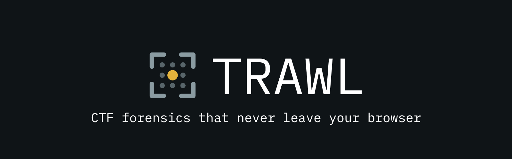

Live at **[trawlctf.vercel.app](https://trawlctf.vercel.app)**.

Drop a file into the page, or paste a string, and Trawl looks for whatever is
hidden in it. Nothing leaves your computer.

It is built for capture-the-flag competitions, where a puzzle often arrives as
an ordinary-looking image, a sound file, or a line of text with a message buried
inside it.

**Status: in development.** [ROADMAP.md](ROADMAP.md) has the current state.
Steganography is done. Cryptography is well along. Web exploration pulls a site
apart and probes it on request. Forensics has just begun.

## What it is for

A competition hands you a photo. Somewhere in it, someone has hidden a password.
It is not written in the picture, it is written into the numbers the picture is
made of, so looking at the image tells you nothing.

The usual answer is four or five separate programs, in three languages, each
installed separately, none of which talk to each other. One is an abandoned Java
applet from 2011. For someone who has done it before, that is fifteen minutes of
habit. For a beginner it is the reason they skip the category.

Trawl runs the same checks from one page, and tells you which one found
something.

## What it can do today

Drop in a PNG, BMP, GIF, WAV or JPEG and it runs everything that applies.

It reads what the file says about itself: hidden text, camera metadata, other
files buried inside it, and anything stuck on the end where a viewer would never
look. Buried files can be saved out with one click, and files inside a ZIP or
carved out of the middle are scanned with the same checks automatically, a few
levels deep, until a shared budget stops the walk.

Then Cuttlefish, the steganography half, goes after the data itself. It shows
every layer of an image at once so an odd one stands out. It tries up to 84 different
ways of reading hidden bits rather than making you guess which. Two published
statistical tests estimate how much of a file is carrying a payload. Sound files
get the same bit-level treatment, plus a spectrogram, because drawing a picture
into audio is a common trick and it only shows up when you look at the sound
instead of listening to it. JPEGs get their compressed numbers read directly,
which is where JPEG payloads live, whether the file is an ordinary one or the
progressive kind that loads in passes. Images that paint by numbers get their
palette read too, since two entries holding the same colour let a pixel pick
either one and that choice carries a message no viewer can show you. An animated
GIF is read one frame at a time, every displayed frame and the difference between
each pair put through the same detectors, so a flag hidden in one frame or in the
jump between two frames does not survive the playback.

Paste a string instead of dropping a file and Mantis takes over, the
cryptography half. It works out what the string has been through and undoes it,
layer by layer: base64 wrapped around hex wrapped around a rotation, unwound
until something readable falls out. When a layer peels to a compressed stream,
gzip or zlib, that layer is inflated and peeled after, within the same layer
budget. If what is underneath turns out to be
encrypted rather than encoded, it attacks it: XOR, Caesar, Vigenère, affine,
rail fence and columnar transposition, and simple substitution, each recovering
its own key rather than asking you for one. When none of them fires it shows the
letter counts it was working from, and lays out every rotation it knows with the
ones that decode onward first, so you can finish by eye. It will not guess: an
answer that is a token rather than a sentence reads like nothing to a scorer, and
saying so beats picking one at random and sounding sure.

Everything found collects in the Cod-end, the panel at the top of the page.
Its header carries the list of flag shapes the detectors report against:
`flag{`, `CTF{`, `key{` and a few more on by default, and you can add your own.
A button next to it hands the whole analysis back as a Markdown writeup, to the
clipboard or as a file.

On first load a short tour walks through what to drop in and what to look for.
The three files it uses are built in your browser, each with a flag hidden a
different way: in the low bits of an image, in the bytes after the image ends,
and in the samples of a tone. The demos panel keeps those and four larger
practice files available anytime: a picture drawn into a WAV spectrogram, the
same WAV with text in its low bits, and a clean/modified pair for checking
duplicate PNG palette entries. Run any of them in place or save it for later.

A link is the newest kind of input. Remora, the web-exploration half, is for a
challenge that lives on a site rather than in a file you were handed. A browser
tab cannot reach a site it was not served from, so Remora runs as a small program
you start on your own machine with one line the page hands you; once it is
running, the page finds it and switches to a box for the target address.

From there it pulls the site apart into the things Trawl already reads. It
follows the links, the scripts, and what robots and the sitemap give away to the
pages nothing advertises, and tries a short list of the places a file gets left
where it should not be. Each page is read for a flag sitting in plain sight, in a
comment or a response header, and for one that was hidden: a base64 cookie, a hex
or ROT13 variable, a colour written as CSS escapes, an array XORed against a byte,
each decoded only far enough to see whether a flag falls out. An image it finds
is opened in a new tab against Cuttlefish, the same tools a dropped picture gets,
because a website is only ever made of the things Trawl reads anyway.

That much only reads. A second mode, off until you affirm you are allowed to test
the target, sends what a page did not ask for: a quote in a parameter to draw out
an error, a privilege field into an update, a timestamp into a window that opens
only for now. If a response hands back a JSON web token, it recovers the signing
key when the site was careless enough to leak it and mints one that says you are
an administrator. When you already have a lead, a box takes it and tries it in
every place a name might belong.

## What it will not tell you

Trawl never claims to have found a flag it has not actually checked. When a
result is uncertain it says what it measured and lets you decide.

Every detector is tested against files with a known answer, and also against
clean files, to make sure it stays quiet when there is nothing there. That
second half matters more than it sounds. A tool that reports something on every
file is no better than one that reports nothing.

## Why not just upload it to an AI

Because the model never receives your file.

Before any part of the network sees an image, it is decoded, shrunk, and turned
into averages. Shrinking replaces each pixel with a blend of its neighbours, and
a blend of two numbers does not preserve the last digit of either. The hidden
message is in those last digits. It is gone before the model starts reading.

So the answer you get back is either an honest "I cannot see that", or a
confident invented one. Under a competition clock, the second costs you real
time.

An assistant that can run code is a different case. It can read the bytes. What
it produces is a fresh, untested program every time, and a program that finds
nothing because it has a bug looks exactly like a file with nothing in it.

## Everything runs on your machine

There is no server, no upload, no account, no tracking. After the page loads
once it works with the network unplugged. Your file is opened read-only and
never changed.

That also settles a rules question. Most competitions forbid passing challenge
files to outside services, and Trawl has nowhere to send yours.

Web exploration is the one part that touches the network, because reaching a site
is the whole job. It is kept honest by where it runs. There is still no server of
ours; Remora is a program on your own machine, and it talks only to the target you
named and to your own browser. The page uploads nothing, the same as ever.

## How it works

The analysis is written in Rust and compiled to WebAssembly, running in a
background thread so the page stays responsive. Some of these checks are
hundreds of millions of small calculations, so the speed is the point rather
than a preference.

Nothing is borrowed. `package.json` lists no runtime dependencies and neither
does the Rust core. Every parser, detector and attack here was written for this
project, including the PNG, BMP, GIF, WAV and JPEG decoders and the Fourier
transform behind the spectrogram.

One thing worth knowing: the browser's own image decoder cannot be trusted with
this. Ask a canvas for pixel values on an image with any transparency and it
quietly alters the lowest bit of a fifth of them, through the arithmetic it uses
to store transparent colour. That bit is the data being looked for. No canvas
setting turns it off, so Trawl decodes images itself, and the test suite
measures both paths: the browser one to record how it fails, ours to prove every
sample comes back untouched.

## Running it locally

Needs Rust with the `wasm32-unknown-unknown` target, `wasm-pack`, and Node 20 or
newer.

```bash
git clone https://github.com/yuv1s/trawl
cd trawl
npm install
npm run build:wasm
npm run dev
```

Tests:

```bash
npm test                              # the interface
cd trawl-core && cargo test           # the analysis core
```

Test files are built from scratch by `fixtures/generate.mjs`, so every result the
tests claim can be reproduced rather than taken on trust.

## Sample files

A labelled [sample library](static/samples/README.md) covers the common survey,
steganography, archive, AES, and Mantis tools. Each entry names the expected
result and whether to drop the file into Trawl or paste its contents. Clean PNG,
JPEG, and WAV controls are included beside the planted samples.

The library stays under `static/samples/` because SvelteKit serves it at
`/samples/`, which is also where the built-in practice panel loads its files.

Remora, the web scanner, is a separate crate under `trawl-scan`. It is the one
part that reaches the network, so it is kept apart from the offline core. From a
clone, `npm run scanner` builds and starts it; users never do this, they run the
one line the page gives them.

## The names

Trawling is dragging a net through water and sorting whatever comes up, which is
close to what this does with a dropped file.

**Cuttlefish** is the steganography half. Cuttlefish hide by rewriting their own
surface, which is what hiding a message in an image does to the picture. Their
ink is also where the colour sepia comes from.

**Mantis** is the cryptography half. The mantis shrimp cracks armoured shells
with the fastest strike in the animal kingdom, and sees a range of colour we are
blind to. Force and perception, which is the whole of code breaking.

**Remora** is the web-exploration half. A remora attaches to a larger host and
rides it, going everywhere the host goes and seeing what it sees. This attaches to
a live site, which in web terms is a host too, and brings back every part of it
for the other tools to read.

**Cod-end** is the closed end of a trawl net, where the catch collects. In the
app it is the panel holding everything the tools brought up.

## Licence

MIT.
